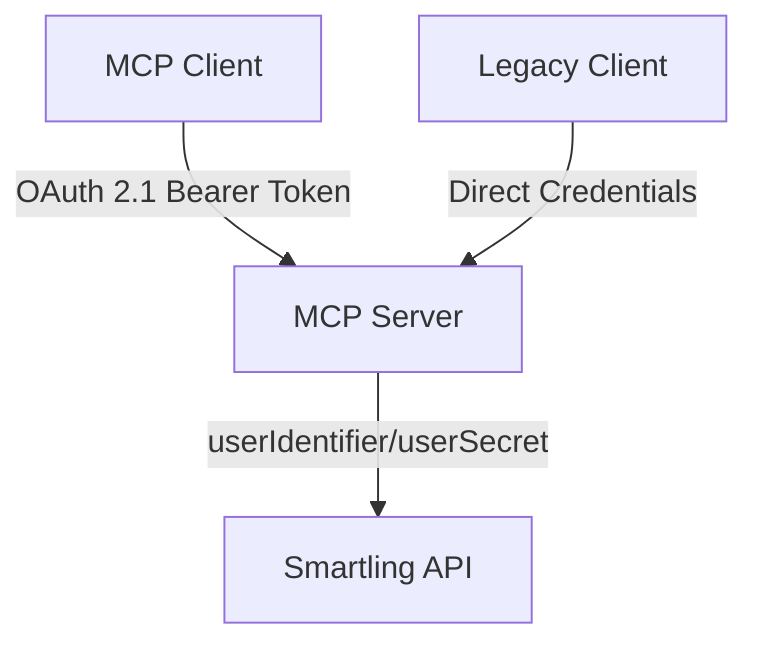

# OAuth 2.1 Migration Guide

## Overview

The Smartling MCP Server now supports OAuth 2.1 with PKCE for enhanced security and MCP protocol compliance. This guide explains the new authentication options and how to migrate from the legacy authentication method.

## 🔄 Authentication Methods

### Legacy Method (Still Supported)
```bash
# Using Smartling userIdentifier/userSecret directly
SMARTLING_USER_IDENTIFIER=your_user_identifier
SMARTLING_USER_SECRET=your_user_secret
```

### ✨ New OAuth 2.1 Method
```bash
# Enable OAuth 2.1 for MCP compliance
ENABLE_OAUTH=true
OAUTH_CLIENT_ID=your_client_id
OAUTH_CLIENT_SECRET=your_client_secret
```

## 🏗️ Architecture

### Hybrid Implementation
Our OAuth implementation provides a **hybrid approach**:

1. **MCP Clients**: Use OAuth 2.1 with Bearer tokens
2. **Smartling API**: Uses existing `userIdentifier`/`userSecret` internally
3. **Backward Compatibility**: Legacy method still works for non-MCP usage



## 🚀 Quick Start

### 1. Enable OAuth (Optional)
```bash
# Copy example config
cp config-example.env .env

# Edit .env file
ENABLE_OAUTH=true
OAUTH_CLIENT_ID=smartling-mcp-server
OAUTH_CLIENT_SECRET=your-secure-secret
```

### 2. Start HTTP Server
```bash
# Build the project
npm run build

# Start OAuth-enabled HTTP server
npm run serve
```

### 3. Test OAuth Endpoints
```bash
# Check health
curl http://localhost:3000/health

# Get OAuth metadata
curl http://localhost:3000/.well-known/oauth-authorization-server

# Get resource metadata  
curl http://localhost:3000/.well-known/oauth-protected-resource
```

## 🔑 OAuth 2.1 Flow

### Client Credentials Grant (Recommended for MCP)
```bash
# 1. Register client (optional - use DCR)
curl -X POST http://localhost:3000/oauth/register \
  -H "Content-Type: application/json" \
  -d '{
    "client_name": "My MCP Client",
    "grant_types": ["client_credentials"],
    "scope": "smartling:read smartling:write"
  }'

# 2. Get access token
curl -X POST http://localhost:3000/oauth/token \
  -H "Content-Type: application/x-www-form-urlencoded" \
  -d "grant_type=client_credentials&client_id=smartling-mcp-server&client_secret=your-secret&scope=smartling:read smartling:write"

# 3. Use token for MCP requests
curl -X POST http://localhost:3000/mcp/tools/list \
  -H "Authorization: Bearer YOUR_ACCESS_TOKEN" \
  -H "Content-Type: application/json" \
  -d '{"jsonrpc": "2.0", "id": 1, "method": "tools/list"}'
```

## 🔐 Scopes

### Available Scopes
- `smartling:read` - Read operations (projects, files, jobs)
- `smartling:write` - Write operations (upload, create, update)
- `smartling:admin` - Administrative operations (delete, manage)
- `smartling:files:read` - File-specific read access
- `smartling:files:write` - File-specific write access
- `smartling:projects:read` - Project-specific access
- `smartling:jobs:read` - Job read access
- `smartling:jobs:write` - Job write access

### Scope Requirements by Endpoint
- `/mcp/tools/list` requires: `smartling:read`
- `/mcp/tools/call` requires: `smartling:read` + `smartling:write`

## 🌐 MCP Client Configuration

### Claude Desktop
```json
{
  "mcpServers": {
    "smartling": {
      "command": "/usr/local/bin/node",
      "args": ["/path/to/smartling-mcp-server/bin.js"],
      "env": {
        "SMARTLING_USER_IDENTIFIER": "your_user_identifier",
        "SMARTLING_USER_SECRET": "your_user_secret",
        "ENABLE_OAUTH": "false"
      }
    }
  }
}
```

### Cursor IDE
```json
{
  "mcpServers": {
    "smartling": {
      "command": "/usr/local/bin/node",
      "args": ["/path/to/smartling-mcp-server/bin.js"],
      "env": {
        "SMARTLING_USER_IDENTIFIER": "your_user_identifier",
        "SMARTLING_USER_SECRET": "your_user_secret"
      }
    }
  }
}
```

## 🔧 Environment Variables

### Required
```bash
SMARTLING_USER_IDENTIFIER=your_user_identifier_here
SMARTLING_USER_SECRET=your_user_secret_here
```

### OAuth Configuration (Optional)
```bash
ENABLE_OAUTH=false                    # Enable OAuth 2.1 (default: false)
OAUTH_CLIENT_ID=smartling-mcp-server  # OAuth client ID
OAUTH_CLIENT_SECRET=change-in-prod    # OAuth client secret
OAUTH_SERVER_URL=                     # External OAuth server (optional)
TOKEN_EXPIRY=3600                     # Token expiry in seconds
```

### Server Configuration (Optional)
```bash
PORT=3000                             # HTTP server port
SMARTLING_BASE_URL=https://api.smartling.com  # Smartling API base URL
```

## 📚 RFC Compliance

Our OAuth implementation follows these RFCs:

- **RFC 6749**: OAuth 2.0 Authorization Framework
- **RFC 7636**: PKCE for OAuth Public Clients  
- **RFC 8414**: OAuth 2.0 Authorization Server Metadata
- **RFC 7591**: OAuth 2.0 Dynamic Client Registration
- **RFC 9068**: JSON Web Token (JWT) Profile for OAuth 2.0 Access Tokens

## 🛡️ Security Features

### Token Validation
- JWT payload validation
- Audience verification (`smartling-mcp-server`)
- Expiration time checks
- Scope-based access control

### Secure Headers
- CORS enabled with proper configuration
- Bearer token authentication
- Secure OAuth endpoint responses

## 🚨 Migration Notes

### For Existing Users
1. **No Action Required**: Legacy authentication continues to work
2. **Optional Upgrade**: Enable OAuth for enhanced security
3. **MCP Compliance**: OAuth required for full MCP protocol compliance

### For New Deployments
1. **Start with Legacy**: Use `userIdentifier`/`userSecret` for simplicity
2. **Enable OAuth**: Add OAuth for production deployments
3. **Follow MCP Standards**: Use OAuth for MCP client compatibility

## 🧪 Testing

### Legacy MCP (STDIO)
```bash
npm run test:mcp
```

### OAuth HTTP Server
```bash
# Start server
npm run serve

# Test health
curl http://localhost:3000/health

# Test OAuth flow
curl -X POST http://localhost:3000/oauth/token \
  -d "grant_type=client_credentials&client_id=smartling-mcp-server&client_secret=your-secret"
```

## 🔍 Troubleshooting

### Common Issues

#### 1. OAuth Not Working
```bash
# Check if OAuth is enabled
curl http://localhost:3000/health
# Should show: "oauth_enabled": true
```

#### 2. Invalid Token
```bash
# Verify token format
echo "YOUR_TOKEN" | base64 -d
# Should show valid JSON payload
```

#### 3. Scope Errors
```bash
# Check required scopes in error response
# Ensure client has correct scopes
```

### Debug Mode
```bash
# Enable debug logging
NODE_ENV=development npm run serve
```

## 📖 Additional Resources

- [Model Context Protocol Specification](https://modelcontextprotocol.io/specification/draft/basic/authorization)
- [OAuth 2.1 Security Best Practices](https://datatracker.ietf.org/doc/html/draft-ietf-oauth-security-topics)
- [Smartling API Documentation](https://api-reference.smartling.com/)

## 💡 Next Steps

1. **Test OAuth Flow**: Try the client credentials grant
2. **Implement PKCE**: For authorization code flow (if needed)
3. **Production Deployment**: Use proper JWT signing and validation
4. **Monitor Usage**: Track OAuth token usage and performance 